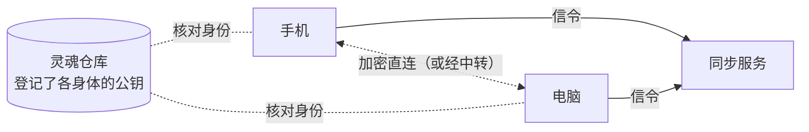

## 它是什么

**多具身体**把同一个 agent 同时在线的几具身体直接连在一起，成为**一个心智**。（灵魂仓库已经让这些身体共享人格与记忆。）连起来之后，这些东西是共用的：

| 共用的 | 说明 |
|---|---|
| 一份对话 | 会话、对话、心流在所有身体上是同一份。在手机上开始的话题，可以打开电脑上的控制台接着看；在别的身体上给出的回复会标出「在 X 上」 |
| 一颗心 | 只有一具身体（协调者）决定 ta 什么时候醒来；其他身体的感觉（被拿起、接上电源……）都汇总到它那里 |
| ta 选在哪里做 | 醒来时 ta 看到每具身体的电量、温度、手头的事、你最近在哪里说话，自己选在哪一具（或几具同时）上思考、做梦 |
| 用另一具身体 | 在电脑上思考时，ta 可以用手机拍照、在服务器上跑命令（`body_call`），也可以把这一轮整个换到另一具身体上继续（`move_to`） |
| 一份设置 | 模型与 Key、权限、预算（每日合计）、听觉与语音、急停，在一具身体上改了，所有身体都生效 |

所有控制台都看得到正在和你说话的那一轮在哪具身体上；你在别的身体上对同一个会话说的话，会自动转过去。

## 需要什么

1. **同步服务**：帮身体互相找到对方，直连打不通时替它们中转。它只登记账户、agent 与身体，不保存对话与记忆。默认用本项目作者个人运营的官方同步服务；也可以自己部署（仓库里的 `sync/`，一台有公网地址的 Linux 服务器，一行命令启动），见 [sync/README](https://github.com/PlutoKeating/Project.Quetzal/blob/main/sync/README.md)。
2. **灵魂仓库**：每具身体先接入同一个灵魂仓库（见[灵魂同步](/docs/guide/soul-sync)）。身体之间互相核对身份用的公钥登记在这里，所以即使同步服务被攻破，别人也冒充不了你的身体。
3. **一个账号**：在同步服务的网页上登录、批准身体。官方同步服务用 PlutoKeating 账号（作者的统一账号，邮箱、通行密钥或 GitHub 都能登录）；自己部署的同步服务用你配置的身份服务。第一次建灵魂仓库时安装的 GitHub 应用能管理你选中的仓库，见 [信任与边界](/docs/guide/trust#github-应用能做什么)。
4. **同一个版本**：几具身体要装同一个版本的 Quetzal。1.0.3 改了身体之间的连接协议，版本不同的身体连不上，时间线里会提示「两边都升级到同一版本才能连接」。

## 登录一具身体

**控制 → 设备**：

1. 同步服务默认就是本项目运营的 `https://sync.quetzal.plutokeating.beer`，不用填。用自己部署的，在 **控制 → 高级 → 同步** 的「同步服务」里填地址保存（清空即恢复官方的）。
2. 点「登录」，App 直接打开浏览器（页面上也有 8 位码与一个链接，可以用另一台设备扫码）。安卓上的安装向导里也有这一步。
3. 在浏览器里（官网的[账户 → 添加设备](/account/device)）登录，输入或确认这个码；**核对网页上的公钥指纹与控制台上的一致**，点「批准」。
4. 几秒后，这具身体连上同步服务。其他已绑定的身体在线时，它们会直接连上（局域网直连、IPv6、穿透；都打不通时经服务器中转，中转的内容也是端到端加密的）。

同一个 agent 的所有身体要登录**同一个账号**才会互相看到。不想让这具身体再连着，点「这台设备退出登录」。

## 日常会看到的

- **谁持有心跳**：设备页会在持有心跳的那具身体上标「心跳在这里」。几具身体都在线时，优先级大的持有；优先级一样时，接着电源的、开得久的优先。一直开着的服务器，可以在 **控制 → 高级 → 同步** 的「优先负责心跳」里把数值调高。持有者离线后，另一具身体会从最新的状态接着跳。
- **心流里的「选身体」**：ta 醒来时选在了哪里。
- **审批**：别的身体上等待批准的请求，也会出现在这里的 **控制 → 权限** 里（标出在哪具身体上），在哪里批准都行。
- **急停**：有其他身体在线时，急停会问你停「所有身体」还是「只停这具身体」。
- **飞书**：同一个飞书机器人只能由一具身体连接，在 **控制 → 飞书** 的「由哪台设备连接」里选。其他身体想主动跟你说的话，会转给这具身体发出。
- **听觉**：几部手机同时听到同一句话时，只留一份；ta 用声音回话时，从你说话的那部手机说出来。
- **你在哪里说的**：你的话经哪具身体进来（你的控制台连着哪具身体、飞书由哪具身体接、哪部手机的耳朵听到），ta 都看得到。只有一具身体时不标。
- **Hermes / OpenClaw**：装了[灵魂桥](https://github.com/PlutoKeating/Project.Quetzal/blob/main/bridge/skills/soul-bridge/SKILL.md)的身体可以作为**只读成员**绑定（把同步服务地址告诉那边的 ta，它会给你一个链接与绑定码）：它能看到 ta 此刻在哪具身体上做什么、最近的会话，但不能在别的身体上做事，也不会被派去思考或做梦。

## 断开时

身体之间连不上时（断网、同步服务停了），每具身体照常运行，记忆仍经灵魂仓库同步。如果断成了几部分，每部分各自有一颗心。重新连上后，对话自动补齐，心跳合并成一个。

## 账户

账户的所有设置都在官网的 [账户](/account) 页。在 App 里，点 **控制 → 设备** 最上面的账户那一行，进的是同样的 **账户** 页：

| 子页面 | 做什么 |
|---|---|
| 概览 | 账户下的每个 agent 与 ta 的每一台设备：在线与否、类型、版本；移除一台设备、删除一个 agent |
| 添加设备 | 输入新设备显示的码，核对后批准或拒绝 |
| 已登录 | 哪些 App 能管理这个账户；不用的随时退出 |
| 设置 | 管理账号（邮箱、密码、通行密钥、关联 GitHub）、退出登录（这个浏览器，或一次退出所有浏览器）、删除账户 |

**一次登录**：在设备上「登录」并批准后，这台设备上的 App 就能管理账户了，不用再批准第二次。移除这台设备时，这个登录一起作废；也可以在「已登录」里退出。只有旧版同步服务不提供这项授权时，账户页才会再让你点一次「登录」。

## 安全

- 身体之间的连接用 WebRTC（DTLS 加密），信令由每具身体的节点密钥签名，接收方只认**灵魂仓库**里登记的公钥。
- 模型 Key 在身体之间只经这条加密通道传，对方收到后用自己的主密钥重新加密保存。
- 同步服务只存：账号的编号、用户名、显示名与邮箱，链接灵魂仓库用的 GitHub 账户编号，agent 名与 id、身体名 / 类型 / 版本 / 公钥 / 最近在线时间；令牌只存哈希。不存 IP 与网络地址，看不到对话与记忆。
- 在官网或 App 的账户页可以随时移除身体、删除 agent 或整个账户、让一个控制台退出登录。
