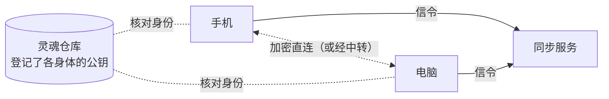

## 它是什么

灵魂仓库让同一个 agent 的几具身体共享人格与记忆；**多具身体**更进一步，让同时在线的身体直接连在一起，变成**一个心智**：

| 共用的 | 说明 |
|---|---|
| 一份对话 | 会话、对话、心流在所有身体上是同一份。在手机上开始的话题，打开电脑上的控制台接着看；别处的回复标出「在 X 上」 |
| 一颗心 | 只有一具身体（协调者）决定 ta 什么时候醒来；其他身体的感觉（被拿起、接上电源……）都汇过去 |
| ta 选在哪里做 | 醒来时 ta 看到每具身体的电量、温度、手头的事、你最近在哪里说话，自己选在哪一具（或几具同时）上思考、做梦 |
| 用另一具身体 | 在电脑上思考时可以用手机拍照、在服务器上跑命令（`body_call`），也可以把这一轮整个换到另一具身体继续（`move_to`） |
| 一份设置 | 模型与 Key、权限、预算（每日合计）、听觉与语音、急停在一处改了处处生效 |

正在和你说话的那一轮在哪具身体上，所有控制台都看得到；你在别处对同一个会话说的话，会自动转过去。

## 需要什么

1. **同步服务**：让身体互相找到、打不通时中转。它不保存对话与记忆，只有账户、agent 与身体的登记。缺省用本项目运营的官方同步服务；也可以自己部署（仓库里的 `sync/`，一台有公网地址的 Linux 服务器，一行命令启动），见 [sync/README](https://github.com/PlutoKeating/Project.Quetzal/blob/main/sync/README.md)。
2. **灵魂仓库**：每具身体先接入同一个灵魂仓库（见[灵魂同步](/docs/guide/soul-sync)）。身体之间互相核对身份用的公钥登记在这里——这是信任的根，同步服务被攻破也冒充不了你的身体。
3. **GitHub 账号**：在同步服务的网页上登录、批准身体。

## 绑定一具身体

**控制 → 多具身体**：

1. 同步服务缺省就是本项目运营的 `https://sync.quetzal.plutokeating.beer`，不用填；自己部署的，把地址填进去保存（清空即恢复官方）。
2. 点「绑定到同步服务」，页面上出现 8 位绑定码与一个链接（也可扫码）。
3. 在浏览器里打开链接（官网的[账户 → 批准设备](/account/device)），用 GitHub 登录，输入绑定码；**核对网页上的公钥指纹与控制台上的一致**，点「批准」。
4. 几秒后这具身体连上同步服务；其他已绑定的身体在线时，它们直接连上（局域网直连、IPv6、穿透，打不通时经服务器中转——中转的内容也是端到端加密的）。

同一个 agent 的所有身体要绑定到**同一个 GitHub 账户**下才会互相看到。

## 日常会看到的

- **谁持有心跳**：多具身体页显示「心跳在 X 上」。几具身体都在线时，优先级大的持有；一样大时，接着电源的、开得久的优先。一直开着的服务器可以把「当协调者的优先级」调高。持有者离线，另一具身体会从最新的状态接着跳。
- **心流里的「选身体」**：ta 醒来时选在了哪里。
- **审批**：别处等待批准的请求也会出现在这里（标出在哪具身体上），在哪里批准都行。
- **急停**：有其他身体在线时，急停会问你停「所有身体」还是「只停这具身体」。
- **飞书**：同一个飞书机器人只能由一具身体连接。在「控制 → 飞书」里选「谁持有飞书」，其他身体想主动跟你说的话会转给它发出。
- **听觉**：几部手机的耳朵同时听到同一句话时只留一份；ta 用声音回话时，从你说话的那部手机说出来。
- **Hermes / OpenClaw**：装了[灵魂桥](https://github.com/PlutoKeating/Project.Quetzal/blob/main/bridge/skills/soul-bridge/SKILL.md)的身体可以作为**只读成员**绑定（把同步服务地址告诉那边的 ta，它会给你一个链接与绑定码）：它能看到 ta 此刻在哪具身体上做什么、最近的会话，但不能在别的身体上做事，也不会被派去思考或做梦。

## 断开时

身体之间连不上（断网、同步服务停了），每具身体照常运行，记忆仍经灵魂仓库同步；如果断成几部分，每部分各自有一颗心。重新连上时对话自动补齐，心跳合并。

## 账户

账户的一切都在官网的 [账户](/account) 页（像控制台的一组子页面），用 GitHub 登录：

| 子页面 | 做什么 |
|---|---|
| 概览 | 账户下的每个 agent 与 ta 的每一具身体：在线与否、类型、版本、公钥指纹；解绑一具身体、删除一个 agent |
| 批准设备 | 输入身体绑定时显示的码，核对后批准或拒绝 |
| 控制台登录 | 哪些 App 能管理这个账户；不用的随时吊销 |
| 账户设置 | 退出登录（这个浏览器，或「退出所有网页登录」一次退出所有浏览器）、删除账户 |

App（安卓与 Linux 桌面）的 **控制 → 账户** 有同样的四页。这具身体绑定后，点「登录账户」，App 给出一个码，在官网的「批准设备」里批准（页面会写明这是「控制台登录」：批准后这个 App 能管理整个账户；同时列出发起方身体的公钥指纹、它绑定的时间与这个码的生成时间，与那台设备上 App「多具身体」页的指纹核对一致、且码是你刚刚生成的再批准）。只有已经绑定在你账户下的身体能发起控制台登录，所以别人骗你批准也拿不到你的账户。

## 安全

- 身体之间的连接用 WebRTC（DTLS 加密），信令由每具身体的节点密钥签名，接收方只认**灵魂仓库**里登记的公钥。
- 模型 Key 在身体之间只经这条加密通道传，到了对方用它自己的主密钥重新加密保存。
- 同步服务只存：GitHub 用户名与显示名、agent 名与 id、身体名 / 类型 / 版本 / 公钥 / 最近在线时间；令牌只存哈希。不存 IP 与网络地址，看不到对话与记忆。
- 在官网或 App 的账户页可以随时解绑身体、删除 agent 或整个账户、吊销控制台登录。
