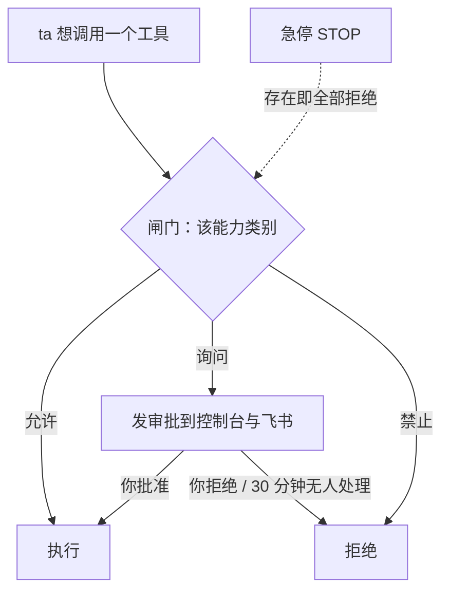

## 闸门在哪里

ta 每次调用一项能力前，都要先经过**闸门**的检查。你在 **控制** 页里管理闸门；飞书卡片上也能做同样的操作，效果一样，都会记进操作记录。

## 能力类别

| 类别 | 默认 | 例子 |
|---|---|---|
| 联网 | 允许 | 搜索、抓取网页 |
| 执行命令 | 允许 | shell、后台任务 |
| 设备功能 | 允许 | 震动、手电、剪贴板、读传感器 |
| 相机 | **每次询问** | 拍照 |
| 麦克风 | **每次询问** | 录音 |
| 定位 | **每次询问** | 获取位置 |
| 主动发消息 | 允许 | ta 醒来时主动给你发消息 |
| 修改自身参数 | 允许 | 在限定范围内调自己的性格参数、声音与听觉设置 |
| 改写记忆 | 允许 | 改人格、常驻记忆 |
| 操作屏幕与应用 | **每次询问** | 预留（hands） |
| 索取保密信息 | 允许 | `pass_secret`，见 [保密传递](/docs/guide/secrets) |
| 会话与子 agent | 允许 | 开新会话、派子 agent 去做事 |
| 跨身体操作 | 允许 | 用另一台设备的相机或命令行（`body_call`）、换到另一台设备继续（`move_to`）、带上另一台设备的 uuid 看那边的图片、读那边的文档、取那边的文件来跑命令（`view_image` / `read_document` / `shell` 带 `body`；把文件交出去的那台设备另按它的「执行命令」判断） |
| 造工具 | **每次询问** | 把做熟了的事写成自己的工具（`tool_write`） |

每类有三档：**允许 / 询问 / 禁止**，在 **控制 → 权限** 里逐项设置。一个工具同时属于几类时，按最严的那一类检查。

> [!WARNING]
> 「执行命令」设为允许时，ta 用命令就能做到设备工具、联网、改文件能做的一切，其他类别的设置拦不住。想收紧，先把「执行命令」改成询问。

## 命令的隔离环境

ta 的命令、后台任务和自造工具都在隔离环境里运行：电脑上依次尝试 bubblewrap、Landlock、proot，安卓上用 proot。隔离环境里看不到密钥目录和控制台的登录信息；第一次使用前会实测一次，确认密钥确实看不见。哪种隔离都用不了时，ta 的命令一律不执行；你可以在 **控制 → 高级 → 运行** 里明确允许不隔离运行。

ta 和运行基座是同一个系统用户，这层隔离挡不住所有情况。剩下的风险和我们的建议见 [信任与边界](/docs/guide/trust#ta-能碰到什么)。在 Windows 上，ta 的命令以安装时建的低权限用户运行，见 [Windows](/docs/advanced/windows) 第 3 节。

## 真实环境

隔离环境里用不了你在电脑上登录过的东西。比如你在终端里登录了 `gh`，ta 在隔离环境里运行 `gh` 仍然会说令牌无效：令牌在系统钥匙串里，隔离环境刻意碰不到它。

确实需要时，ta 可以请求进入**真实环境**，并写明理由。请求出现在对话顶部和 **控制 → 权限**，飞书里是一张审批卡片，手机上还会有一条通知。你点同意后，这个对话里 ta 的命令不再经过隔离环境，直接在这台设备上运行。你也可以点对话右上角的盾牌图标自己打开。

- **能做什么**：你能读写的一切，ta 都能读写，包括密钥目录、保密库和基座的配置。
- **范围**：只在这一个对话、这一台设备上。ta 自己醒来时、子 agent、从别的设备调来的命令，仍在隔离环境里。
- **看得见**：开着的时候，对话顶部和界面最上方有一条红色的提示。每条命令都记在操作记录里，并标出是在真实环境里运行的。
- **退出**：点红色提示上的「退出」，或在飞书发 `/sandbox`；ta 做完也会自己退出。30 分钟没有命令、按急停、运行基座重启，都会回到隔离环境。

只需要一个令牌时，更稳妥的做法是让 ta 用 [保密传递](/docs/guide/secrets) 向你要一个权限尽量小的令牌，命令仍在隔离环境里运行。

## 审批

设为「询问」的能力，ta 想用时会生成一条审批，推送到控制台（**控制 → 权限** 最上面，带角标）与飞书（带按钮的卡片）。你可以批准或拒绝，并附一句话；**30 分钟没人处理就算拒绝**。

## 节律

**控制 → 节律**：

- **活跃度**（安静 ↔ 活跃，0–4）：醒来率会乘上这个值，调高 ta 醒得更勤。
- **暂停**：ta 保持在线、会回应你，但不会自己醒来，只在你找 ta 时醒来。

好奇心、表达欲、想念的时间常数，以及困意、睡眠恢复、最清醒的时刻，这些性格参数由 ta 自己在限定范围内调整（`adjust_self`，属于「修改自身参数」），界面上没有。想让 ta 变一变，直接跟 ta 说，比如「你最近太吵了」。

## 预算与身体限制

**控制 → 高级 → 预算**：每日 token 上限、每日费用上限、最低电量、最高温度。默认 2,000,000 tokens / 5 美元 / 15% / 45°C。

超出限制后，ta 自己醒来的频率会被**压低**：预算用尽 ×0.05、过热 ×0.1、电量低且未充电 ×0.2、离线 ×0.5。ta 会变得非常安静；你叫 ta，ta 照样会应，对话不受预算限制。

## 急停

顶栏的急停**一直显示**。按下后，所有工具调用立即被拒绝，醒来率归零；解除时要再确认一次。急停在家目录下放一个 `STOP` 文件，这个文件在，ta 就停着。

## 操作记录

**控制 → 高级 → 操作记录**：所有工具调用（参数摘要与结果开头）、配置修改、记忆修改、审批决定都记在这里。ta 自己也能查（`recent_actions`），用来核实自己做没做过某件事。

## 时间墙

Quetzal 用**无进展计时**防止失控：模型调用 90 秒没有收到数据块，就算失败并换模型；一轮会话 120 秒没有任何进展，就中止。只要一直在推进，ta 可以做很长的事。
