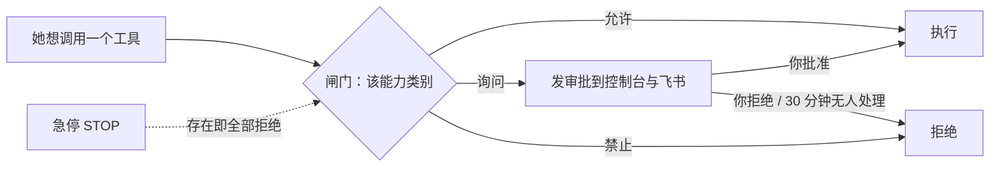

## 闸门在哪里

她调用每一类能力前都会经过**闸门**。你在 **控制** 页里管它，飞书卡片也能做同样的事，两个入口的行为完全一致、都写审计。

## 能力类别

| 类别 | 默认 | 例子 |
|---|---|---|
| 联网 | 允许 | 搜索、抓取网页 |
| 执行命令 | 允许 | shell、后台任务 |
| 设备功能 | 允许 | 震动、手电、剪贴板、读传感器 |
| 相机 | **每次询问** | 拍照 |
| 麦克风 | **每次询问** | 录音 |
| 定位 | **每次询问** | 获取位置 |
| 主动发消息 | 允许 | 她醒来时主动给你发消息 |
| 修改自身参数 | 允许 | 有界地调自己的性格参数 |
| 改写记忆 | 允许 | 改人格、常驻记忆 |
| 操作屏幕与应用 | **每次询问** | 预留（hands） |
| 索取保密信息 | 允许 | `pass_secret`，见 [保密传递](/docs/guide/secrets) |

每类三档：**允许 / 每次询问 / 禁止**。

## 审批

选「询问」的能力，她想用时会生成一条审批，推送到控制台（控制页有角标）与飞书（带按钮的卡片）。你可以批准或拒绝并附一句话；**30 分钟无人处理视为拒绝**。

## 自主性

**控制 → 自主性**：

- **活跃度**（0–4）：乘在醒来率上的旋钮。
- **暂停自主**：她保持在线、会回应你，但不会自己醒来。

## 预算与身体限制

**控制 → 预算**：每日 token 上限、每日费用上限、最低电量、最高温度。默认 2,000,000 tokens / 5 美元 / 15% / 45°C。

超出后不是硬停，而是**抑制**：预算用尽 ×0.05、过热 ×0.1、电量低且未充电 ×0.2、离线 ×0.5。她会变得非常安静，但你叫她还是会应。

## 急停

顶栏的急停**永远可见**。按下后立即拒绝所有工具调用、醒来率归零；解除需要二次确认。它的实现是家目录下一个 `STOP` 文件：存在即冻结。

## 审计日志

**控制 → 审计日志**：所有工具调用（参数摘要与结果开头）、配置修改、记忆修改、审批决定都有记录。她自己也能查（`recent_actions`），用来核实"我做没做过"。

## 时间墙

防止失控的不是步数上限，而是**无进展计时**：模型调用 90 秒没有数据块即失败并换模型；一轮会话 120 秒没有任何进展即中止。她可以做很长的事，只要一直在推进。
