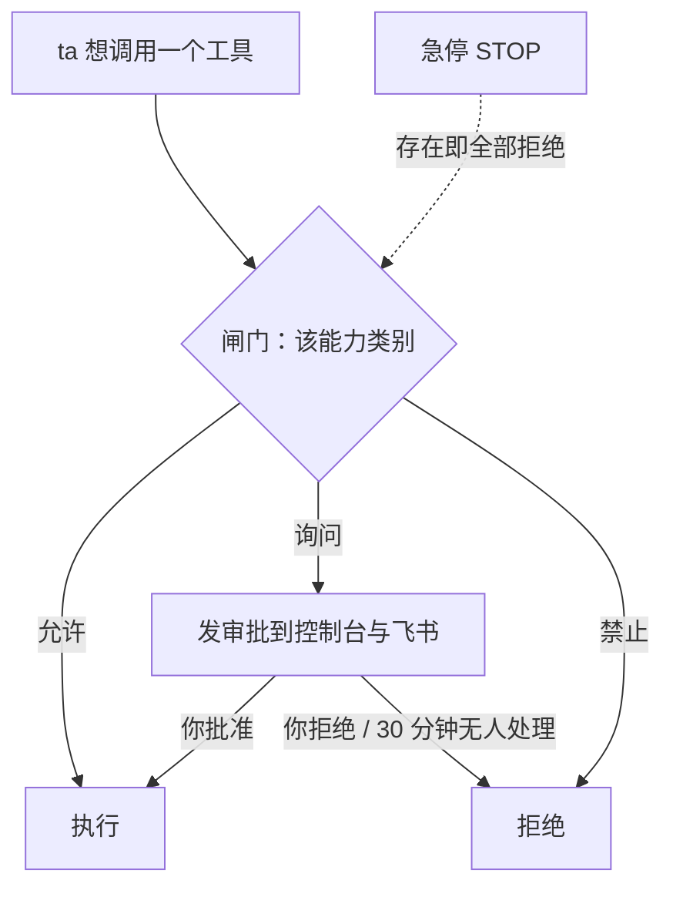

## 闸门在哪里

ta 调用每一类能力前都会经过**闸门**。你在 **控制** 页里管它，飞书卡片也能做同样的事，两个入口的行为完全一致、都写审计。

## 能力类别

| 类别 | 默认 | 例子 |
|---|---|---|
| 联网 | 允许 | 搜索、抓取网页 |
| 执行命令 | 允许 | shell、后台任务 |
| 设备功能 | 允许 | 震动、手电、剪贴板、读传感器 |
| 相机 | **每次询问** | 拍照 |
| 麦克风 | **每次询问** | 录音 |
| 定位 | **每次询问** | 获取位置 |
| 主动发消息 | 允许 | ta 醒来时主动给你发消息 |
| 修改自身参数 | 允许 | 有界地调自己的性格参数、声音与听觉设置 |
| 改写记忆 | 允许 | 改人格、常驻记忆 |
| 操作屏幕与应用 | **每次询问** | 预留（hands） |
| 索取保密信息 | 允许 | `pass_secret`，见 [保密传递](/docs/guide/secrets) |
| 会话与子 agent | 允许 | 开新会话、派子 agent 去做事 |
| 跨身体操作 | 允许 | 用另一台设备的相机或命令行（`body_call`）、换到另一台设备继续（`move_to`） |
| 造工具 | **每次询问** | 把做熟了的事写成自己的工具（`tool_write`） |

每类三档：**允许 / 询问 / 禁止**，在 **控制 → 权限** 里逐项设置。一个工具同时属于几类时，按最严的那一类检查。

> [!WARNING]
> 「执行命令」为允许时，其他类别挡不住 ta：命令能做设备工具、联网、改文件能做的一切。想收紧，先把「执行命令」改成询问。

## 命令的隔离环境

ta 的命令、后台任务和自造工具都在隔离环境里运行：电脑上依次尝试 bubblewrap、Landlock、proot，安卓上用 proot。隔离环境里看不到密钥目录和控制台的登录信息；第一次使用前会实测一次，确认密钥真的看不见。一种隔离都用不了时，ta 的命令一律不执行，除非你在 **控制 → 高级 → 运行** 里明确允许不隔离运行。

ta 和运行基座是同一个系统用户，这层隔离挡不住所有情况。剩下的风险和我们的建议见 [信任与边界](/docs/guide/trust#ta-能碰到什么)。

## 审批

选「询问」的能力，ta 想用时会生成一条审批，推送到控制台（**控制 → 权限** 最上面，带角标）与飞书（带按钮的卡片）。你可以批准或拒绝并附一句话；**30 分钟无人处理视为拒绝**。

## 节律

**控制 → 节律**：

- **活跃度**（安静 ↔ 活跃，0–4）：乘在醒来率上的旋钮。
- **暂停**：ta 保持在线、会回应你，但不会自己醒来，只在你找 ta 时醒来。

好奇心、表达欲、想念的时间常数，困意、睡眠恢复、最清醒的时刻这些性格参数不在界面上：ta 自己会有界地调（`adjust_self`，属于「修改自身参数」）。想让 ta 变一变，直接跟 ta 说，比如「你最近太吵了」。

## 预算与身体限制

**控制 → 高级 → 预算**：每日 token 上限、每日费用上限、最低电量、最高温度。默认 2,000,000 tokens / 5 美元 / 15% / 45°C。

超出后 ta 自己醒来的频率会被**压低**：预算用尽 ×0.05、过热 ×0.1、电量低且未充电 ×0.2、离线 ×0.5。ta 会变得非常安静，但你叫 ta 还是会应，对话不受预算限制。

## 急停

顶栏的急停**永远可见**。按下后立即拒绝所有工具调用、醒来率归零；解除需要二次确认。它的实现是家目录下一个 `STOP` 文件：存在即冻结。

## 操作记录

**控制 → 高级 → 操作记录**：所有工具调用（参数摘要与结果开头）、配置修改、记忆修改、审批决定都有记录。ta 自己也能查（`recent_actions`），用来核实"我做没做过"。

## 时间墙

防止失控靠**无进展计时**：模型调用 90 秒没有数据块即失败并换模型；一轮会话 120 秒没有任何进展即中止。ta 可以做很长的事，只要一直在推进。
