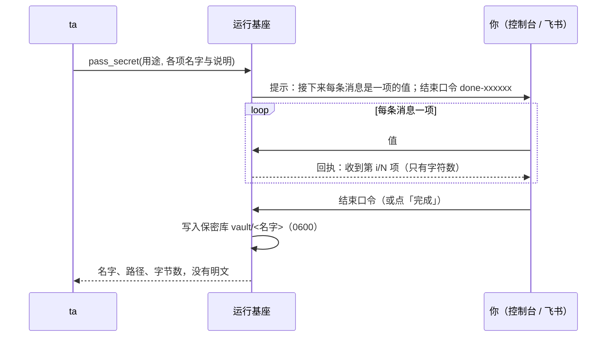

## 为什么需要它

ta 需要密码、令牌这类凭据时，会调用 `pass_secret` 发起一次**保密输入**，你在聊天框里发的值直接存进保密库。ta 做事时常常要用到凭据：GitHub 令牌、某个服务的密码、一把私钥。直接发在对话里的话，明文会进入对话记录、模型上下文和供应商的日志。

## 流程

- ta 先用自己的话说明要哪几项、每项是什么。
- 之后你发的**每条消息就是一项的值**，按顺序对应。值只去掉开头和结尾的空白，多行的值（如私钥）原样保存。
- 发完后，回复**结束口令**（也可以点控制台上的「完成」按钮，「重填」「取消」按钮同理）。发 `口令 重来` 清空重填，发 `口令 取消` 放弃。
- **10 分钟没有动静就自动放弃**，已收到的值直接丢弃。只有收到结束口令，值才会写进保密库。

在控制台里，保密输入期间输入框上方有一条提示，输入的内容默认被遮住（点眼睛图标可显示；多行的值要先点开显示再粘贴）。在飞书里，进度显示在一张随时更新的卡片上；结束后请**自己撤回**那几条消息。

## 保密库

保密库在 `QUETZAL_HOME/vault/`，每项一个文件，文件名就是这一项的名字。在 **控制 → 高级 → 保密库** 里可以查看每项的名字、说明、来源与时间，也可以删除；这里**不显示内容**。

保密库只属于这具身体，**不同步到别的身体**，也不进灵魂仓库。

## ta 怎么用

ta 在命令里按路径引用保密值（如 `"$(cat 路径)"` 或 `< 路径`），不把内容打印出来。所有工具的输出在交给模型之前都会检查一遍，里面出现的保密值会被替换成 `‹secret:名字›`。

> [!WARNING]
> 这套做法防的是**无意泄露**（`cat`、`env`、调试输出）。ta 的命令能读到保密库：安卓和 Linux 上 ta 与运行基座是同一个系统用户，Windows 上沙箱用户也被授权读它。模型看不到明文，靠的是保密输入的流程、工具的使用约定和输出替换，操作系统层面没有隔离。不希望 ta 接触的凭据，就不要交给 ta。

## 可以禁止

「索取保密信息」是一个单独的能力类别，可以在 **控制 → 权限** 里设为询问或禁止。ta 只能在和你对话时发起保密输入；ta 自己醒来时你不在场，工具会提示 ta 先约你。
