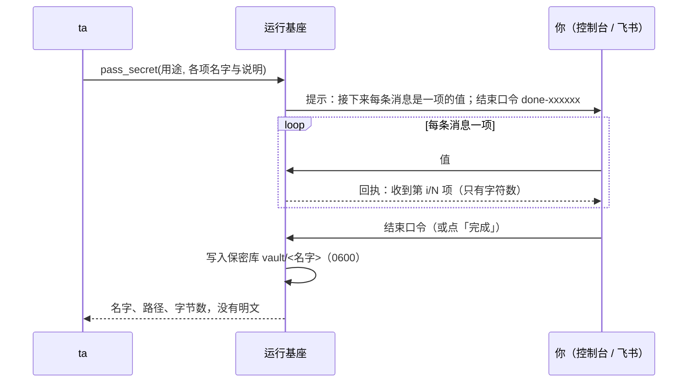

## 为什么需要它

ta 在做事时经常需要凭据：GitHub 令牌、某个服务的密码、一把私钥。如果你把它发在对话里，明文会进入对话记录、模型上下文和供应商的日志。所以 ta 会调用 `pass_secret`，发起一次**保密输入**。

## 流程

- ta 先用自己的话解释要哪几项、每项是什么。
- 之后你发的**每条消息就是一项的值**，按顺序对应。值只去掉首尾空白，多行的值（如私钥）原样保存。
- 发完回**结束口令**（控制台有「完成 / 重填 / 取消」按钮等价）。`口令 重来` 清空重填，`口令 取消` 放弃。
- **10 分钟没有动静自动放弃**；放弃时已收到的值直接丢弃，只有结束口令才落盘。

在控制台里，保密输入期间输入框上方有提示条，输入框默认遮挡（点眼睛可显示，多行值需要显示后再粘贴）。在飞书里是一张随进度更新的卡片；结束后请**自己撤回**那几条消息。

## 保密库

保存在 `QUETZAL_HOME/vault/`，每项一个文件，文件名即名字。**控制 → 高级 → 保密库** 可以查看名字、说明、来源与时间，可以删除，**不显示内容**。

它只属于这具身体，**不同步到别的身体**，也不进灵魂仓库。

## ta 怎么用

ta 在命令里按路径引用（如 `"$(cat 路径)"` 或 `< 路径`），不输出内容。所有工具的输出在交给模型之前都会经过替换：出现的保密值会变成 `‹secret:名字›`。

> [!WARNING]
> 这防的是**无意泄露**（`cat`、`env`、调试输出）。ta 与基座是同一个系统用户，保密库对 ta 的 shell 是可读的；"看不到明文"由协议、工具约定与输出替换共同保证；操作系统层面没有隔离。如果你不希望 ta 接触某类凭据，就不要交给 ta。

## 可以禁止

「索取保密信息」是一个独立的能力类别，可以在 **控制 → 权限** 里设为询问或禁止。ta 只能在对话中发起保密输入；自己醒来时没有在场的人，工具会提示 ta 先约你。
