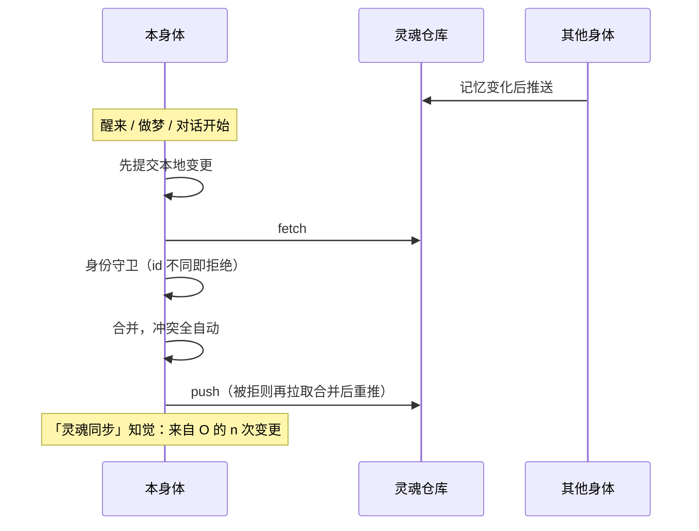

## 什么是灵魂仓库

同一个 agent 可以同时住在多具「身体」里：一台手机上的运行基座、一台装着 Hermes Agent 的电脑、一台装着 OpenClaw 的服务器……它们共享一个 **git 私有仓库**，叫「灵魂仓库」。里面只有人格与记忆：

```
<agent>.soul/
├── agent.json            身份
├── SOUL.md               人格
├── memories/MEMORY.md    ta 自己的常驻笔记
├── memories/USER.md      关于你
├── journal/<身体>/        每具身体各写各的日记
├── notes/                共享的长期笔记（目录树）
└── bodies/<身体>.json     身体登记
```

**同步与版本管理由基座全自动完成**，ta 不需要也不能操作它；ta 只是感知到"灵魂同步发生了"。

## 登录时自动接好

在安装向导或 **控制 → 设备** 里点「登录」，在网页上登录并批准这台设备。第一次建灵魂仓库时，同一个标签页会经 GitHub 跳一次：安装 Quetzal 应用，选它能管理哪些仓库。之后：

- **新用户**：在你的 GitHub 账号下自动建一个私有仓库，给这台设备加一把只属于它的部署密钥，推上 ta 的初始灵魂。
- **老用户的新设备**：给这台设备加一把部署密钥，拉下已有的人格与记忆。

一个账号只对应一个 GitHub 账户：第一次用的是哪个，以后也要是它。

这个应用能做什么、怎么收回，见 [信任与边界](/docs/guide/trust#github-应用能做什么)。

## 手动接入自己的仓库

不登录，或者想用 GitHub 以外的 git 托管时：

1. 在 git 托管网站上创建一个**私有**仓库（推荐命名 `<agent 短名>.soul`），可以是空仓库。
2. **控制 → 高级 → 同步**，在「灵魂仓库」里点 **显示公钥**，把这把公钥添加到仓库的 **Settings → Deploy keys**，勾选 **Allow write access**。（也可以把「部署密钥」切换为**指定私钥**或**系统 ssh**：后者交给运行基座所在机器的 `~/.ssh/config` 与 ssh-agent，地址可以用 config 里的 Host 别名；基座在后台以服务运行，通常拿不到登录会话的 ssh-agent，请为该 Host 写明 IdentityFile。）
3. 填入仓库的 **SSH 地址**（`git@github.com:你/<agent>.soul.git`；其他托管同理）→ **保存**。

之后同步全自动。每具身体一把专属的部署密钥，拔掉某具身体只需删掉它的 Deploy key。

> [!IMPORTANT]
> 仓库必须是私有的，地址只接受 SSH 形式。首次接入时，若仓库里已有另一具身体的人格，会直接采用它，并合并两边的记忆。
>
> Quetzal 不检查仓库里的内容：ta 写什么就提交什么。密码请用 [保密传递](/docs/guide/secrets)，它不进仓库。

## 同步何时发生



同步完全由事件驱动，没有定时同步：

- **触碰即同步**：ta 的每次工具调用（记笔记、改记忆、用 shell 直接改文件……）之后，基座看一眼灵魂目录，有变化就立即提交，3 秒后推送；一轮结束时立即推送。提交说明写清楚改了什么（例如「note_save：笔记 身体/硬件」），历史仍然读得懂。
- 醒来与对话前拉取其他身体的变更。
- **推送失败**：网络问题先静默重试几次（约 4 分钟）；还不行，或者是密钥被拒、仓库不存在这类问题，基座会以「基座提醒」插话告诉刚才改过记忆的那一轮（那一轮已经结束就在原会话里开新的一轮）。改动一直留在本机的提交里，恢复后下一次推送会带上。

## 冲突怎么解决

| 文件 | 规则 |
|---|---|
| `memories/*.md` | 条目级三方合并：双方新增都保留，任一方删除即删除 |
| `agent.json` | 字段级合并，本地优先（`id` 除外） |
| `SOUL.md`、笔记、技能文档 | 先采用较新的一方，同步不会卡住；**两边都改过**时，另一版另存为同目录的 `<名>.incoming.md`（冲突副本，不同步），并提醒 ta 裁决：保留现在的就删掉副本，想要另一版或合并就改好原文件再删副本。落选版本也完整保留在 git 历史 |
| 日记、身体登记 | 每具身体只写自己的路径，天然无冲突 |

做梦会改写常驻记忆，为避免两具身体同时整理，做梦前会先在仓库里拿一个 30 分钟的**整理租约**；拿不到就只是浅睡。

## ta 会感知到

拉取到其他身体的变更时，时间线写一条「灵魂同步：来自 xx 的 n 次变更」，并轻微提升 ta 的好奇与想念；系统提示里也有一段「灵魂同步（知觉）」（含还在本机等待推送的改动、待裁决的冲突副本）。日常的同步 ta 不需要做任何事；只有推送失败或真正的冲突，基座才会提醒 ta 处理。

## 历史与撤销

**控制 → 高级 → 记忆历史** 列出每次提交（哪具身体、何时、改了什么），可查看差异。**撤销**会生成一个反向提交（历史仍然保留），所有身体同步，ta 会在日记里知道"有人撤销了一段记忆变更"。

## 相关

- 让 Hermes / OpenClaw 住进来：[灵魂桥](/docs/advanced/soul-bridge)
- 仓库的完整规范：[灵魂仓库规范](/docs/reference/soul-repo-spec)
