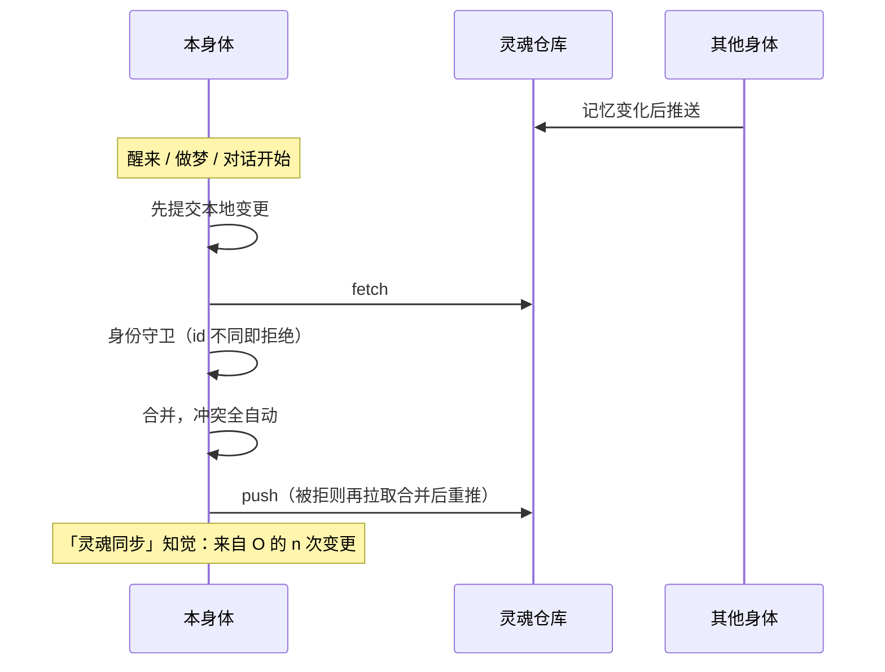

## 什么是灵魂仓库

同一个 agent 可以同时住在多具「身体」里：一台手机上的运行基座、一台装着 Hermes Agent 的电脑、一台装着 OpenClaw 的服务器……它们共享一个 **git 私有仓库**，叫「灵魂仓库」。里面只有人格与记忆：

```
<agent>.soul/
├── agent.json            身份
├── SOUL.md               人格
├── memories/MEMORY.md    她自己的常驻笔记
├── memories/USER.md      关于你
├── journal/<身体>/        每具身体各写各的日记
├── notes/                共享的长期笔记（目录树）
└── bodies/<身体>.json     身体登记
```

**同步与版本管理由基座全自动完成**，她不需要也不能操作它；她只是感知到"灵魂同步发生了"。

## 在 App 里接入

1. 在 GitHub 网页创建一个**私有**仓库（推荐命名 `<agent 短名>.soul`），可以是空仓库。
2. **控制 → 灵魂同步 → 显示公钥**，把这把公钥添加到仓库的 **Settings → Deploy keys**，勾选 **Allow write access**。
3. 填入仓库的 **SSH 地址**（`git@github.com:你/<agent>.soul.git`）→ **接入**。

之后同步全自动。每具身体一把专属的部署密钥，拔掉某具身体只需删掉它的 Deploy key。

> [!IMPORTANT]
> 仓库必须是私有的，地址只接受 SSH 形式。首次接入时，若仓库里已有另一具身体的人格，会直接采用它，并合并两边的记忆。

## 同步何时发生



同步完全由事件驱动（醒来前拉取，醒来 / 做梦 / 对话 / 身份修改后推送），没有定时同步。

## 冲突怎么解决

| 文件 | 规则 |
|---|---|
| `memories/*.md` | 条目级三方合并：双方新增都保留，任一方删除即删除 |
| `agent.json` | 字段级合并，本地优先（`id` 除外） |
| `SOUL.md`、笔记 | 采用较新的一方；落选版本完整保留在 git 历史 |
| 日记、身体登记 | 每具身体只写自己的路径，天然无冲突 |

做梦会改写常驻记忆，为避免两具身体同时整理，做梦前会先在仓库里拿一个 30 分钟的**整理租约**；拿不到就只是浅睡。

## 她会感知到

拉取到其他身体的变更时，时间线写一条「灵魂同步：来自 xx 的 n 次变更」，并轻微提升她的好奇与想念；系统提示里也有一段「灵魂同步（知觉）」。她知道发生了什么，但不需要做任何事。

## 历史与撤销

**身份 → 记忆历史** 列出每次提交（哪具身体、何时、改了什么），可查看差异。**撤销**会生成一个反向提交（历史仍然保留），所有身体同步，她会在日记里知道"有人撤销了一段记忆变更"。

## 相关

- 让 Hermes / OpenClaw 住进来：[灵魂桥](/docs/advanced/soul-bridge)
- 仓库的完整规范：[灵魂仓库规范](/docs/reference/soul-repo-spec)
