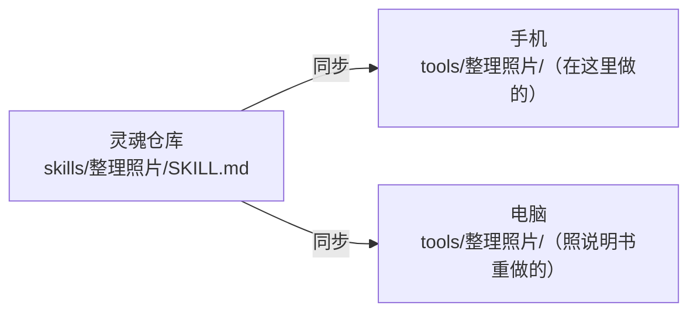

## 它是什么

同一件事做过几次、步骤稳定、以后还会用，ta 会把它写成**自己的工具**。之后这个工具和内置工具一样出现在 ta 的工具表里，一步就能调用。做梦时 ta 也会回顾最近做过的事，看看有没有值得写成工具的。

每个自造工具分成两半：

| | 放在哪 | 同步吗 |
|---|---|---|
| **工具本身**（可执行的脚本） | 这具身体的家目录 `tools/<名字>/` | 不同步，只属于这具身体 |
| **说明书**（技能文档 `SKILL.md`） | 灵魂仓库 `skills/<名字>/` | 随灵魂同步到所有身体 |

## 为什么这样分

不同身体的环境不一样：手机上是 App 内置的精简环境，Linux 电脑上是完整的 Linux，Windows 电脑上是 PowerShell，命令和路径都不同。直接把脚本复制过去，多半跑不起来。所以灵魂里只同步**意图**：用途、参数、思路、依赖、怎么验证、踩过的坑。ta 在每具身体上按说明书自己把工具做出来。

ta 在一具新身体上醒来，看到灵魂里有说明书、这具身体上还没有对应的工具，就知道可以照着做一个。

说明书采用 [Agent Skills](https://agentskills.io/specification) 开放格式，装了[灵魂桥](/docs/advanced/soul-bridge)的 Hermes、OpenClaw 也能直接读。

## 你能控制什么

- **造工具默认每次询问**：工具是以后会被执行的代码，所以新建、改写工具都会先请你批准。可以在 **控制 → 权限** 里改成允许或禁止。
- **调用按「执行命令」检查**：工具自己声明属于哪一类，也不能让检查变松。
- **在沙箱里运行**：和 ta 的其他命令一样，工具看不到基座的密钥目录；超时就把它启动的所有进程一起停掉；每次调用都记进操作记录。
- **控制 → 高级 → 工具**：查看这具身体上的工具，停用、启用或删除（可以连说明书一起删）。手机上不能编辑工具的代码。

## 实现细节

工具的文件格式（`tool.json` + `tool.sh` / `tool.mjs`）、校验规则与闸门见源码仓库的 [ARCHITECTURE.md §5.2](https://github.com/PlutoKeating/Project.Quetzal/blob/main/docs/ARCHITECTURE.md)；技能文档的格式见[灵魂仓库规范](/docs/reference/soul-repo-spec)。
