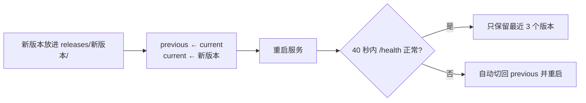

## 升级

Windler App 内置了运行基座。装新版 APK 后，App 发现内置的版本比运行中的新，会在首页提示**一键升级**；也可以在 **控制 → 服务 → 升级 / 重装** 手动触发。

升级走的是和安装相同的脚本（幂等）：

- 她的记忆、配置、Key、保密库都在家目录里，与版本目录分离，**升级不影响它们**。
- 升级后她会以新版本重新醒来（相当于睡了一觉）。

> [!TIP]
> App 版本号与运行基座版本号一致。「服务」页会显示运行中的版本与 App 内置的版本。

## 自动回退

新版本在 40 秒内没有响应健康检查，脚本会自动把 `current` 指回上一版并重启，并在向导里报告原因。你不需要做任何事。

## 手动操作

**控制 → 服务**：

- **重启**：进程退出，由 runit 立即拉起（需要二次确认）。
- **升级 / 重装**：重新执行安装脚本，用于修复损坏的安装。
- **点火**：基座离线时，App 通过 Termux 重新执行开机脚本启动它。

## 熔断与安全模式

10 分钟内启动超过 5 次视为反复崩溃，基座进入**安全模式**：只开网关与飞书，不醒来、不调用模型，并主动告知你。排查方法见 [排错](/docs/advanced/troubleshooting)。

## 从 GitHub 获取版本

所有正式版本都在 GitHub Releases 发布并附发版介绍。[下载页](/download) 实时读取最新版本与历史版本。
