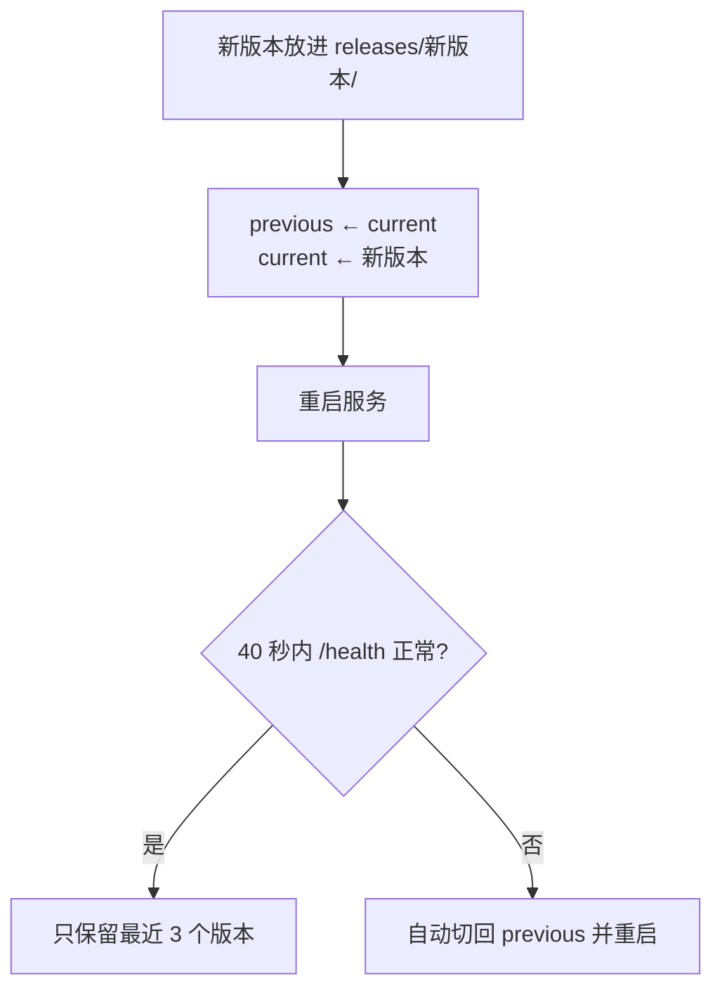

## 升级

**先看「关于」**：控制 → 关于，三种形态（安卓 App、Linux 桌面版、网页版）都有这一页：简介、控制台与运行基座的版本、「检查更新」（问 GitHub 最新正式版）与升级按钮。安卓上升级 App 自身（下载 APK、核对、交给系统安装器），Linux 桌面版与网页版上点「升级到 x.y.z」，运行基座会在它所在的机器上后台重跑安装脚本并重启一次，桌面版装完再点「重新打开控制台」。

**Linux 机器**：也可以手动再跑一次安装命令 `curl -fsSL https://quetzal.plutokeating.beer/install | bash`（或 `npx @plutokeating/quetzal`），新版本（含网页控制台）放进新的版本目录，健康检查通过才切换，失败自动切回；`quetzal rollback` 手动回退。

**手机**：分两层，都在 App 里一键完成。

1. **App 自身**：每次打开 App 都会问 GitHub 有没有新的正式版，有就在顶部提示「Quetzal App 有新版本」。点「更新」进 **控制 → 服务 → Quetzal App**，点**下载并安装**：下载 APK、核对发布签名与 SHA256（见 [发布签名与校验](/docs/start/install#发布签名与校验)），确认新 APK 与已装的 App 是同一个签名证书，再交给系统安装器；任何一项不通过就不装。第一次会先打开系统设置让你允许 Quetzal 安装应用，回来自动接着装。也可以随时在那里「检查新版本」；连不上 GitHub 时「去下载页」手动下载 APK，后面一样。
2. **运行基座**：运行基座和它的运行环境（Node.js、git、ssh、proot）都在 App 里，**升级 App 就是升级运行基座**。新 App 装好后，系统的「应用已更新」广播会让它自动重新启动运行基座；厂商系统拦截了后台唤起（没放行「自启动」）时，打开一次 App 即可。

> [!NOTE]
> 手机上没有自动回退：新版运行基座起不来时，App 会退避着反复重启它并把原因写进日志（见 [排错](/docs/advanced/troubleshooting)）。

**Linux 机器**上的升级走和安装相同的脚本（幂等）：

- ta 的记忆、配置、Key、保密库都在家目录里，与版本目录分离，**升级不影响它们**。
- 升级后 ta 会以新版本重新醒来（相当于睡了一觉）。

> [!TIP]
> App 版本号与运行基座版本号一致。「服务」页会显示运行中的版本与 App 内置的版本。

## 自动回退（Linux）

新版本在 40 秒内没有响应健康检查，安装脚本会自动把 `current` 指回上一版并重启，并报告原因。你不需要做任何事。

## 手动操作

**控制 → 服务**：

- **重启**：进程退出，由守护者立即拉起（手机上是 App 的前台服务，Linux 上是 systemd 或守护循环；需要二次确认）。
- **升级 / 重装**：手机上重启 App 内置的运行基座并核对网关，Linux 上重新执行安装脚本；用于修复损坏的安装。
- **点火**：基座离线时，App 重新启动自己的前台服务。

## 熔断与安全模式

10 分钟内启动超过 5 次视为反复崩溃，基座进入**安全模式**：只开网关与飞书，不醒来、不调用模型，并主动告知你。排查方法见 [排错](/docs/advanced/troubleshooting)。

## 从 GitHub 获取版本

所有正式版本都在 GitHub Releases 发布并附发版介绍。[下载页](/download) 实时读取最新版本与历史版本。
