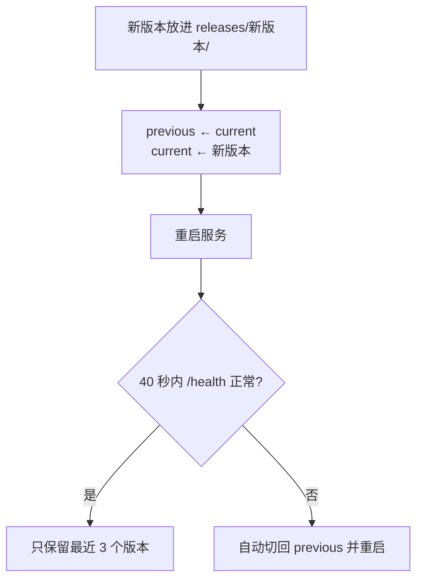

## 升级

**先看「关于」**：打开 **控制 → 关于**，「版本」卡片上写着当前版本，有新版时卡片上会出现一个按钮。安卓 App、Linux 与 Windows 桌面版、网页版都有这一页。

- 安卓上点「更新到 x.y.z」，升级的是 App 自身：下载 APK、核对，再交给系统安装器。
- 桌面版与网页版上点「更新到 x.y.z」，运行基座会在它所在的机器上，在后台重跑安装并重启一次（约一分钟）。桌面版装完后自动换上新的控制台。

**Linux 机器**：也可以手动再跑一次安装命令 `curl -fsSL https://quetzal.plutokeating.beer/install | bash`（或 `npx @plutokeating/quetzal`）。新版本（含网页控制台）放进新的版本目录，健康检查通过才切换过去，失败就自动切回；运行 `quetzal rollback` 可以手动回退。

**Windows 电脑**：在控制台「关于」里点一下。安装包会先关掉正在运行的 Quetzal（升级前会征得你的同意），装好后 40 秒内健康检查不通过，就退回上一版；运行 `quetzal rollback` 可以手动回退。详见 [Windows](/docs/advanced/windows)。

**手机**：分两层，都在 App 里一键完成。

1. **App 自身**：每次打开 App，它都会检查有没有新的正式版，有就在顶部提示「新版本 x.y.z」。点「更新」进 **控制 → 关于**，在「版本」卡片上点**更新到 x.y.z**。App 会下载 APK、核对发布签名与 SHA256（见 [发布签名与校验](/docs/start/install#发布签名与校验)）、确认新 APK 与已装的 App 是同一个签名证书，再交给系统安装器；任何一项不通过就不装。第一次更新时，App 会先打开系统设置，请你允许 Quetzal 安装应用，回来后自动接着装。你也可以随时在这里点「检查更新」；检查不到时，点「去下载页」手动下载 APK，之后的步骤一样。
2. **运行基座**：运行基座和它的运行环境（Node.js、git、ssh、proot）都在 App 里，**升级 App 就是升级运行基座**。新 App 装好后，系统发出「应用已更新」的通知，App 收到后自动重新启动运行基座，在后台把它换成新版。这时顶部显示「正在更新到 x.y.z…」，不用进向导；没完成时会提示「更新没完成」，点「重试」。厂商系统拦住了后台启动（没放行「自启动」）时，打开一次 App 即可。

> [!NOTE]
> 手机上没有自动回退：新版运行基座起不来时，App 会反复重启它，每次间隔越来越长，并把原因写进日志（见 [排错](/docs/advanced/troubleshooting)）。

**Linux 机器**上的升级和安装用的是同一个脚本，重复运行也没有问题：

- ta 的记忆、配置、Key、保密库都在家目录里，与版本目录分离，**升级不影响它们**。
- 升级后 ta 会在新版本里重新醒来，就像睡了一觉。

> [!TIP]
> App 版本号与运行基座版本号一致。**控制 → 高级 → 运行** 显示运行中的版本，「关于」显示 App 的版本。

## 自动回退（Linux）

新版本在 40 秒内没有响应健康检查时，安装脚本会自动把 `current` 指回上一版、重启，并报告原因。你不需要做任何事。

## 手动操作

**控制 → 高级 → 运行**：

- **重启**：运行基座的进程退出，由守护者立即重新启动（手机上是 App 的前台服务，Linux 上是 systemd 或守护循环）；点了之后要再确认一次。
- **重装**（手机）：重新安装 App 内置的运行基座并核对网关，用来修复损坏的安装。Linux 上要修复安装，再跑一次安装命令。

基座离线时，「此刻」页的离线横幅上有一个「启动」按钮，点了 App 会重新启动自己的前台服务。这个按钮只在安卓上、连的是这台手机自己的运行基座时出现。

## 熔断与安全模式

10 分钟内启动超过 5 次，就算作反复崩溃，基座进入**安全模式**：只开网关与飞书，不醒来、不调用模型，并主动告诉你。排查方法见 [排错](/docs/advanced/troubleshooting)。

## 版本与发版介绍

每个正式版本都附有发版介绍。[下载页](/download) 实时列出最新版本与历史版本。

Quetzal 还在快速变化，有时一天会发好几个版本。升级前，你可以先读这一版改了什么。升级不会动 ta 的记忆，灵魂仓库的格式每次变化都兼容旧仓库。几具身体要升到同一个版本才能互连，见 [信任与边界](/docs/guide/trust#更新有多快)。
