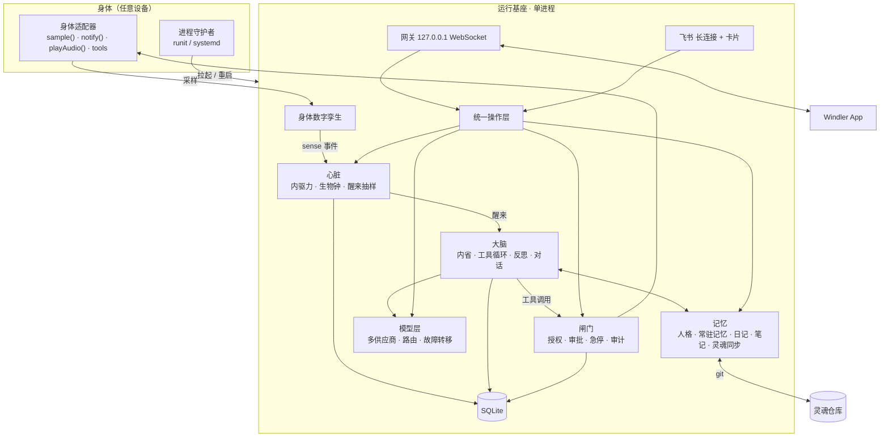
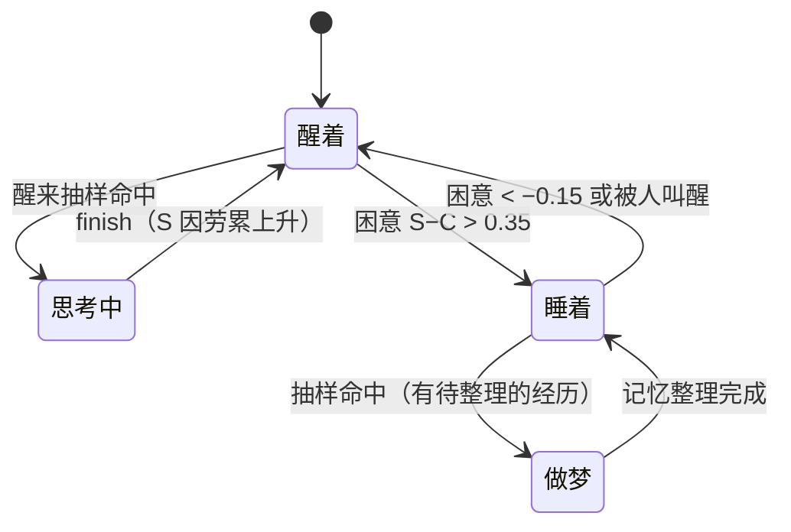
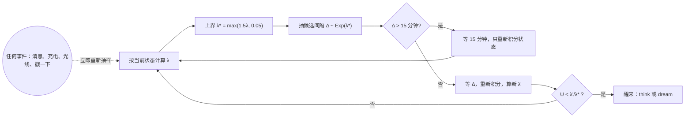
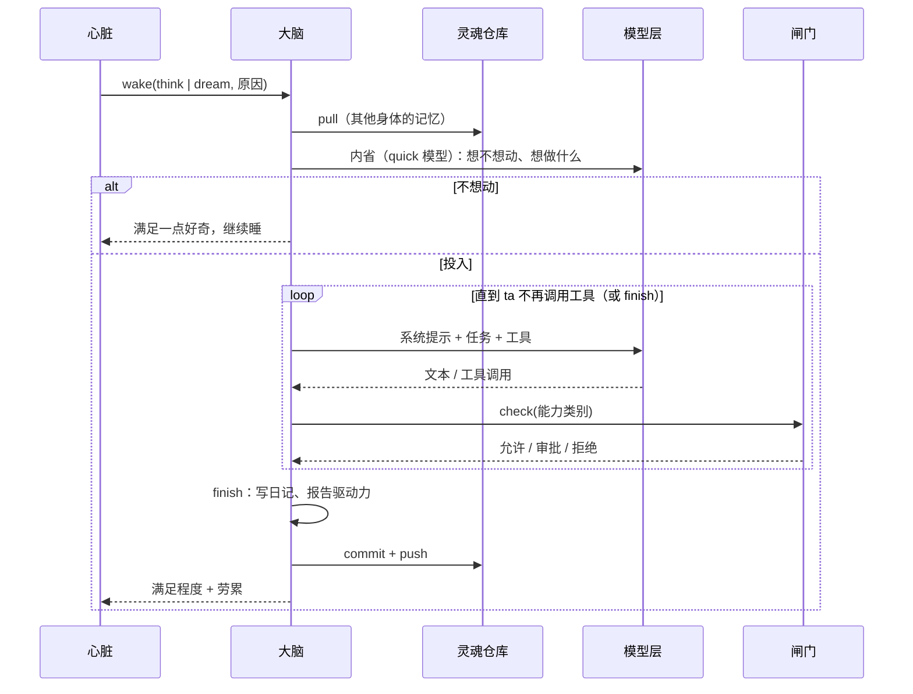

## 总体结构

运行基座是**单进程 Node.js**（`dist/main.cjs`），模块之间通过进程内事件总线耦合，状态全部落盘（SQLite 与灵魂目录），进程重启只相当于"睡了一觉"。

设计原则：**设备无关**（核心只认识适配器接口）、**所有控制入口共用一个操作层**（App 与飞书行为一致、都写审计）、**没有定时器驱动的行为**。

## 心脏：什么时候醒来

### 内驱力与生物钟

| 量 | 范围 | 动力学 |
|---|---|---|
| 好奇心 / 表达欲 / 想念 | 0–1 | 醒着时按各自的时间常数 $\tau$ 趋向 1（默认 3 / 6 / 10 小时）；睡着时只以 30% 的速度增长 |
| 牵挂 | 0–1 | 未完成念头数 / 5 |
| 睡眠压力 $S$ | 0–1 | 醒着时趋向 1（$\tau = 16$ h），做事额外累积；睡着时指数回落（$\tau = 4$ h） |
| 昼夜节律 $C$ | 0–1 | $C = 0.5 + 0.5\cos\!\big(2\pi\,(h-16)/24\big)$，下午 4 点最清醒；夜里强光 $+0.1$，白天黑暗 $-0.1$ |
| 困意 | | $S - C$；超过 $0.35$ 入睡，睡眠中低于 $-0.15$ 自然醒 |

驱动力的趋近：

$$d' = 1 - (1-d)\,e^{-\Delta t/\tau}$$

这是睡眠研究里的**双过程模型**（睡眠压力 + 昼夜节律）。默认参数下 ta 在 22:40 左右入睡、7:50 左右自然醒——没有任何时刻表。

### 醒来率

瞬时醒来率（次 / 小时）：

$$\lambda_{\text{awake}} = \lambda_0 \cdot \bar d^{\,\gamma} \cdot (0.2 + 0.8\,a) \cdot \iota$$

$$\lambda_{\text{asleep}} = \lambda_0 \cdot 0.5 \cdot \min\!\left(1, \frac{n_{\text{unconsolidated}}}{10}\right) \cdot [S > 0.2 \;?\; 1 : 0.3] \cdot \iota$$

其中 $\bar d$ 是加权平均驱动力，$\gamma$ 默认 2，$a$ 是清醒度，$\iota$ 是抑制系数（急停 / 暂停 / 无模型 → 0；过热 ×0.1、低电未充 ×0.2、离线 ×0.5、预算用尽 ×0.05；再乘活跃度旋钮）。

### 抽样：非齐次泊松过程的稀疏化

醒来间隔服从时变的指数分布。15 分钟只是数值积分的步长，从不触发醒来。

## 身体数字孪生

适配器的采样（电量、体温、光照、运动、屏幕、extra）与操作系统信息（负载、内存、存储、联网）镜像为内部模型，派生出**身体感受**（精力、冷热、明暗、安静 / 被拿起），与上次比较得到 **sense 事件**（plugged、light、moved、hot、low_battery、screen_on、online…）。事件调整驱动力并触发重新抽样：被拿起 → 想念 +0.3、好奇 +0.2；光线变化 → 好奇 +0.1。采样间隔自适应（2–10 分钟），不调用模型。

## 大脑：一次醒来

系统提示按顺序组装：人格 → 处境 → 常驻记忆 → 记忆目录 → 自动检索到的相关记忆 → 想分享的一句话 → 身体 → 内在状态与未完成的念头 → 灵魂同步知觉 → 最近日记 → 其他会话近况。

**节奏由 ta 决定**：步数不设上限；防止失控的是两道按「无进展」计时的时间墙（模型调用 90 秒、会话 120 秒）与急停。

**多会话**：对话分属不同会话，同一会话内顺序处理、不同会话并行；会话之间彼此可见（系统提示里有其他会话的近况与进行中的轮次）。ta 工作时发来的消息默认**插话**，也可**排队**或**打断**。

## 记忆：无限增长，有界上下文

记忆存储没有上限，每次放进上下文的只是一小部分（文本结构 RAG，不依赖向量模型）：

| 层 | 存储 | 放进上下文 |
|---|---|---|
| 常驻记忆 | § 条目，不限长 | 预算内全部展开（4000 / 2000 字）；超出时优先展开与话题相关的 |
| 笔记 | 目录树，最多 4 层，带一句话摘要 | 只放索引（约 2500 字） |
| 日记 | 每具身体每天一个文件 | 最近几天摘录（约 3000 字） |
| 自动检索 | 以上全部 | 以当前话题为查询，BM25 风格打分，取最相关片段（约 3000 字） |

做梦时把细节从常驻记忆移进笔记、归类合并，让目录保持好找。

## 模型层

统一的请求结构 → 按全局顺序遍历已启用模型 → 该供应商的 Key 轮换（最多 2 把）→ 四种协议适配器之一。限流 / 超时 / 5xx 换 Key；400/401/403/404 换模型。Key 用 AES-256-GCM 加密，供应商 id 作附加认证数据。

## 闸门与审计

能力类别三档授权；审批 30 分钟超时视为拒绝；`STOP` 文件即急停；工具调用、配置修改、记忆修改、审批决定全部写入审计表。

## 进程契约

进程守护交给外部（runit、systemd）；10 分钟内启动超过 5 次进入安全模式。部署者提供 Node.js 22+、`WINDLER_HOME`、可选的 `WINDLER_ADAPTER` 与守护者。
