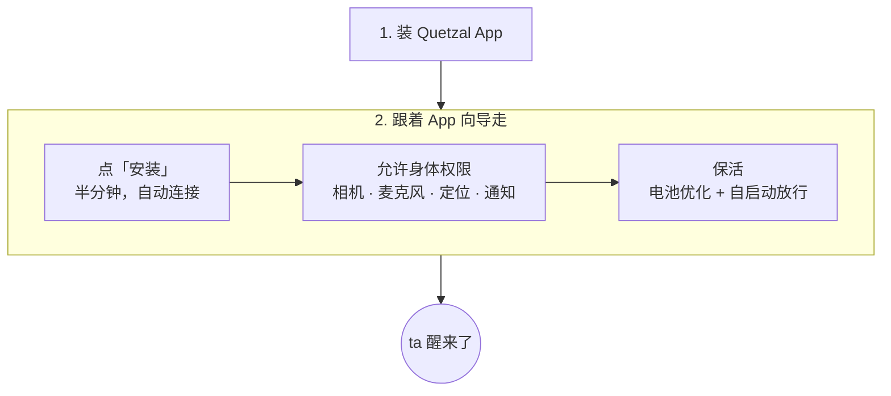

## 总览

只装一个 App。运行基座、Node.js、git、ssh 都在 Quetzal App 里，不需要 Termux，也不需要命令行。（装到 Linux 电脑或服务器上是另一条路：一行 `curl -fsSL https://quetzal.plutokeating.beer/install | bash`，见 [Linux 与其他机器](/docs/advanced/other-machines)。）



要求：**Android 7 以上、arm64** 的手机。

## 1. 安装 Quetzal App

从 [下载页](/download) 下载最新的 APK 并安装。首次安装可能需要允许「安装未知来源应用」。想确认 APK 没被改过，见下面的 [发布签名与校验](#发布签名与校验)。

## 2. 跟着向导走

打开 Quetzal，首页选 **「在这台手机上安装 Quetzal」**，向导一共三步：

1. **安装运行基座**：点「安装」。App 解开内置的运行环境、启动运行基座、核对网关，半分钟左右完成；控制台**自动连接**，不需要配对码。运行基座跑在 App 自己的前台服务里（通知栏常驻一条「ta 住在这台手机里」）。
2. **让 ta 感觉得到身体**：点「允许」，依次同意相机、麦克风、定位（以及 Android 13 以上的通知）。这只是系统层面的授权；ta 每次使用前，仍然要经过你在 App 里设的[能力授权](/docs/guide/permissions)（相机、麦克风、定位默认每次询问）。
3. **让 ta 不被系统杀掉**：把 Quetzal 加入**电池优化的忽略名单**，并在厂商的「自启动 / 后台运行」管理里**放行**它。

> [!IMPORTANT]
> 不少厂商系统（如 EMUI、MIUI、ColorOS）默认不让没放行的应用在后台被唤起：不放行「自启动」，开机后、App 升级后 ta 不会自己醒来，要打开一次 App 才行。

> [!WARNING]
> 有锁屏密码的手机：Android 的文件级加密要求**重启后解锁一次**，App 的数据才可用，ta 才会醒来。

### 从 Termux 版换过来

以前按 Termux 方式装的用户：先在旧版控制台确认灵魂已推送到灵魂仓库（**控制 → 灵魂同步**），然后卸载旧的 Quetzal 与 Termux 三个应用，装新的 App；装好后**先不要改身份**，在 **控制 → 灵魂同步** 里接入同一个灵魂仓库，ta 的人格与记忆就回来了。对话记录不在灵魂仓库里，不会随之迁移。

## 装好之后

打开 Quetzal 的「此刻」页，你会看到 ta 的状态与驱动力。在给 ta 配置模型之前 ta 不会醒来。接着看 [第一步](/docs/start/first-steps)。

**升级**：以后有新版时 App 会在顶部提示，**控制 → 服务 → Quetzal App →「下载并安装」**一键装好新 App；新 App 带着新版运行基座，装好后自动重新启动（被厂商拦截时打开一次 App 即可）；详见 [升级与回退](/docs/guide/upgrade)。

## 发布签名与校验

每个版本的发布页除了安装包，还有两个文件：

- **`SHA256SUMS`**：这个版本每个安装包（安卓 APK、Linux 原生控制台包）的 SHA-256，外加一行 `commit <提交哈希> v<版本>`，写明它是从仓库的哪个提交构建的。
- **`SHA256SUMS.sig`**：项目发布密钥对 `SHA256SUMS` 的 Ed25519 签名（base64）。私钥只在发布流水线里。

发布公钥（原始 32 字节，base64url）：

```text
QbWLzC1yhOWroLTHtHiAAvVWq1UtWDiQP--D9wHaLU8
```

App 的自身更新、Linux 一键安装脚本、灵魂桥的 `self-update` 都内置了这把公钥，签名或哈希对不上就拒绝安装。手动下载时也可以自己核对：把安装包与这两个文件放在同一个目录，装有 Node.js（15 以上）即可：

```bash
# 1. 核对签名：SHA256SUMS 确实出自本项目的发布流水线
node -e 'const c=require("crypto"),f=require("fs");const k=c.createPublicKey({key:{kty:"OKP",crv:"Ed25519",x:"QbWLzC1yhOWroLTHtHiAAvVWq1UtWDiQP--D9wHaLU8"},format:"jwk"});process.exit(c.verify(null,f.readFileSync("SHA256SUMS"),k,Buffer.from(f.readFileSync("SHA256SUMS.sig","utf8").trim(),"base64"))?0:1)' && echo 签名有效
# 2. 核对安装包：只取哈希行（commit 那一行不是哈希，sha256sum 会警告），跳过没下载的文件
grep -E '^[0-9a-f]{64}  ' SHA256SUMS | sha256sum -c --ignore-missing
```

两步都通过（第一步打印「签名有效」，第二步对应文件显示 `OK`）才说明安装包没有被改过。任何一步失败都不要安装。
