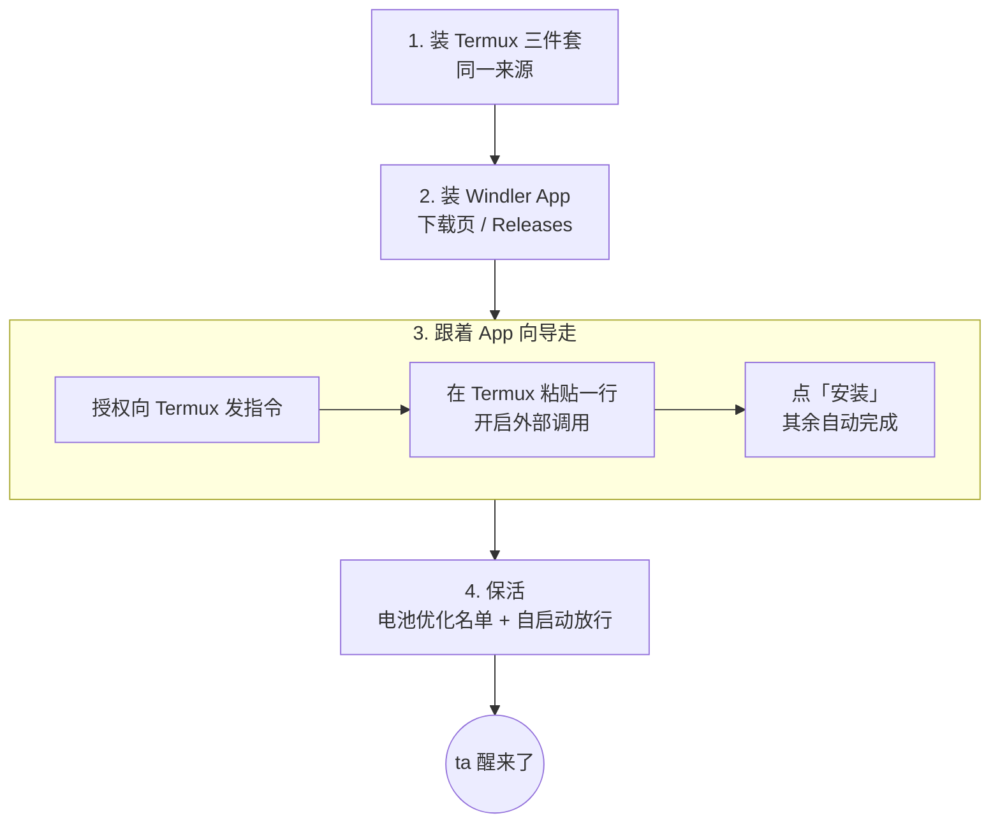

## 总览

安装分四步：装 Termux 三件套 → 装 Windler App → 在 App 的向导里安装运行基座 → 让系统不要杀掉它。整个过程几分钟，下载几十 MB。

## 1. 安装 Termux 三件套

从 [F-Droid](https://f-droid.org/packages/com.termux/)（或 Termux 的 GitHub 发布页）安装这三个应用：

| 应用 | 作用 |
|---|---|
| **Termux** | 运行基座所在的 Linux 环境 |
| **Termux:API** | 电量、传感器、通知、相机、麦克风、定位、剪贴板——没有它 ta 感知不到身体 |
| **Termux:Boot** | 开机自动启动（没有它重启后要手动点火） |

> [!IMPORTANT]
> 三个必须来自**同一来源**（签名一致），否则它们之间无法通信。Google Play 上的 Termux 已废弃，不要用。

装好后**打开 Termux 一次**，等它初始化完成（第一次打开会解压环境，需要几十秒）。

## 2. 安装 Windler App

从 [下载页](/download) 或 GitHub Releases 下载最新的 APK 并安装。首次安装可能需要允许「安装未知来源应用」。

## 3. 跟着向导安装运行基座

打开 Windler，首页选 **「在这台手机上安装 Windler」**，向导会依次带你完成：

1. **安装 Termux 三件套** —— 向导会检测三者是否已安装、版本是否匹配；没装的会给出链接。
2. **允许 Windler 向 Termux 发指令** —— 系统弹出「在 Termux 中运行命令」的权限请求，请允许。
3. **在 Termux 里开启外部调用（唯一需要你动手的一步）** —— 点「复制并打开 Termux」，在 Termux 里**长按 → 粘贴 → 回车**，执行那一行，然后回到 Windler 点「我已执行，检测」。这一行只做一件事：往 Termux 的配置里写入 `allow-external-apps=true`，让 Windler 之后能请 Termux 执行安装脚本。
4. **安装运行基座** —— 点「安装」。向导在 Termux 里自动完成：安装 Node.js、runit、Termux:API 命令行与 git；放入 App 内置的运行基座；注册 runit 服务、日志与开机脚本；写入身体名字与时区；启动并做健康检查。你会看到分步进度。装完后控制台**自动连接**，不需要配对码。

> [!NOTE]
> 中国大陆网络下载软件包慢时，向导会按系统语言自动选用大陆镜像源。安装过程中请让 Windler 保持在前台——运行基座的文件是从 App 里取的。

## 4. 让 ta 不被系统杀掉

安卓会清理后台应用。向导最后一步会引导你：

- 把 **Termux、Termux:Boot、Termux:API 和 Windler** 加入**电池优化的忽略名单**；
- 在厂商的「自启动 / 后台运行」管理里**放行**它们；
- **打开一次 Termux:Boot**，让系统登记它。

> [!WARNING]
> 有锁屏密码的手机：Android 的文件级加密要求**重启后解锁一次**，Termux 的数据才可用，ta 才会醒来。这不是 Windler 的限制，任何装在 Termux 里的程序都一样。

## 装好之后

打开 Windler 的「此刻」页，你会看到 ta 的状态与驱动力。在给 ta 配置模型之前 ta 不会醒来——继续看 [第一步](/docs/start/first-steps)。

**升级**：以后装新版 APK 后，App 发现内置的运行基座比运行中的新，会提示一键升级；详见 [升级与回退](/docs/guide/upgrade)。
