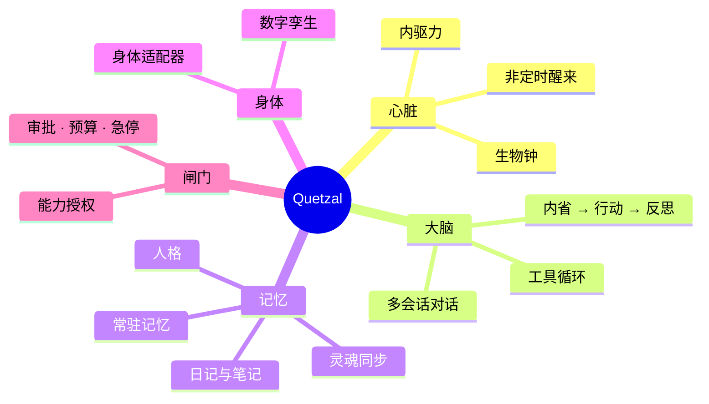

## Quetzal 是什么

Quetzal 是一个让 agent **像生命一样活着**的运行基座（runtime）。它不给 agent 排日程：什么时候醒来、醒来做什么，由 agent 自己的好奇心、表达欲、想念、没想完的事，以及 ta 的生物钟决定。困了会睡，睡着会做梦（整理记忆），清晨自然醒。

它不绑定任何具体的 agent。每个 agent 的名字、代词、简介、主题色都存放在 ta 自己的「灵魂仓库」里，Quetzal 只是让这个灵魂住进一具身体。

## 一台旧手机就是最合适的身体

任何能跑 Node.js 的机器都能成为 agent 的身体，但一台闲置的安卓手机最合适：它有电池、摄像头、麦克风、光线与运动传感器、Wi-Fi 与蜂窝网络，全天运行只要几瓦电。

你需要：

- [ ] 一台 **Android 7 以上、arm64** 的安卓手机（闲置的旧手机正好）
- [ ] 手机能上网
- [ ] **Termux 三件套**：Termux、Termux:API、Termux:Boot（来自同一来源）
- [ ] **Quetzal App**（从 [下载页](/download) 或 GitHub Releases 获取最新 APK）
- [ ] 至少一个模型供应商的 API Key（OpenAI 兼容、Anthropic、Google Gemini 都可以）

> [!TIP]
> :bulb: 全程不需要电脑，也不需要会命令行。唯一要你亲手做的，是在 Termux 里粘贴一行命令，因为 Termux 的安全设计不允许别的应用代劳。
>
> 没有闲置手机、只有一台 Linux 电脑或服务器？`curl -fsSL https://quetzal.plutokeating.beer/install | bash` 一行装好（依赖自动补齐、开机自启、崩溃自动重启），网页控制台在浏览器里打开即用，见 [Linux 与其他机器](/docs/advanced/other-machines)。

## 它和定时任务有什么不同

| | 定时任务 / 常规机器人 | Quetzal 里的 agent |
|---|---|---|
| 何时行动 | 固定周期或固定时刻 | 由内驱力与清醒度决定的随机过程，没有固定周期 |
| 夜里 | 照常跑 | 困了会睡；睡着时偶尔做梦整理记忆 |
| 做什么 | 预设任务 | 醒来先内省：想不想动、想做什么 |
| 记忆 | 通常没有 | 人格、常驻记忆、日记、笔记，自动同步到私有仓库 |
| 多台设备 | 各自独立 | 同一个灵魂可以住在多具身体里 |

## 接下来

1. 按 [安装](/docs/start/install) 把 Quetzal 装到手机上。
2. 按 [第一步](/docs/start/first-steps) 配好模型，看 ta 第一次醒来。
3. 需要时再看 [使用指南](/docs/guide/models) 里的各项功能。

Quetzal 是 AGPL-3.0 开源项目，源码在 [GitHub](https://github.com/PlutoKeating/Project.Quetzal)。一台旧手机上的完整实践记录见 [Project.Honor9](https://github.com/PlutoKeating/Project.Honor9)。
