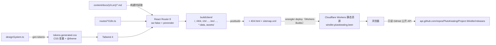

# website · 架构

## 1. 构建与托管

- **没有服务端**：Worker 只有静态资源配置（`wrangler.jsonc` 的 `assets`），不含脚本。未知路径由 `404.html` 兜底（`not_found_handling: "404-page"`）。
- **预渲染**：`react-router.config.ts` 用 `app/lib/prerender.ts` 列出所有路径（语言 × 页面 + 文档页）。路由 `loader` 在构建时执行，结果写成 `.data` 文件，客户端导航时读取；因此页面不能依赖运行时服务端。
- **语言**：`/` 预渲染为一个只含内联跳转脚本的页面；`/:lang/*` 共用 `routes/layout.tsx`（顶栏、页脚、语言校验）。`<html lang>` 由 `root.tsx` 按路径参数设置。

## 2. 设计系统

`app/design-system/designSystem.ts` 是唯一事实源，分为：语义色（深 / 浅两套，键一致）、圆角与描边、阴影与光效（引用色变量，随明暗切换）、透明度、动效时长与曲线、字体与字号、容器宽度与断点、矮窗口阈值。

`scripts/gen-tokens.ts` 生成三段 CSS：`:root` 深色变量；`prefers-color-scheme: light` 与 `[data-theme]` 的覆盖；`@theme inline` 把 Tailwind 的 `--color-*`、`--radius-*`、`--shadow-*`、`--blur-*`、`--ease-*`、`--font-*`、`--text-*`、`--container-*`、`--breakpoint-*` 命名空间先清空（`initial`）再映射到 `--ds-*` 变量。于是 Tailwind 内置调色板与阴影在本项目里不存在，页面只能用语义类名。另有 `short:` 变体对应矮窗口（横屏手机）。

`scripts/lint-tokens.ts` 在构建前扫描 `app/`（设计系统目录除外）。

## 3. 响应式与横竖屏

- 宽度断点来自设计系统（`sm`…`2xl`），高度用 `short:`（`max-height`），方向用 Tailwind 内置的 `portrait:` / `landscape:`。
- 首屏使用 `min-h-dvh`、`viewport-fit=cover`，横屏矮窗口时压缩纵向留白（`landscape:short:py-*`）。
- 所有间距、字号均为 rem，不写像素。

## 4. 页面与数据

| 路径 | 内容 | 数据来源 |
|---|---|---|
| `/` | 语言跳转 | 内联脚本 |
| `/:lang` | 首页 hero 与分节 | `routes/home/i18n.ts` |
| `/:lang/features` | 亮点功能 | `routes/features/i18n.ts` |
| `/:lang/docs/*` | 文档教程：侧栏、正文（统一 Markdown 组件）、页内目录 | `content/docs/<lang>/**/*.md`（构建时读取） |
| `/:lang/download` | 最新版本、资产下载、发布说明、历史版本、Termux 三件套链接 | 浏览器直连 GitHub Releases 公开 API（sessionStorage 缓存），不硬编码版本 |
| `/:lang/about` `terms` `privacy` | 关于 / 条款 / 隐私 | 各自 `i18n.ts` |
| `/404` | 404 页 | — |
